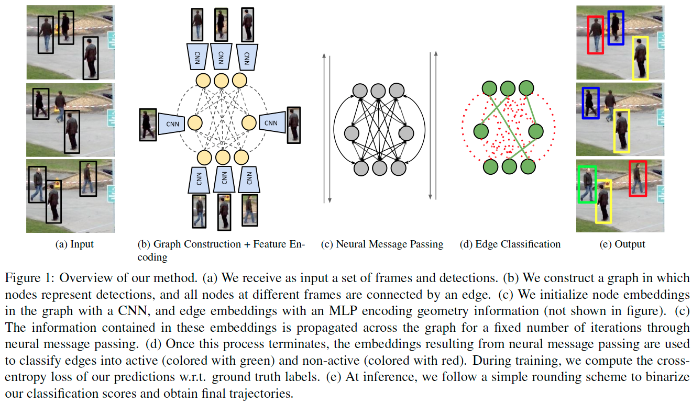

# Learning a Neural Solver for Multiple Object Tracking

This the official implementation of our **CVPR 2020 (oral)** paper *Learning a Neural Solver for Multiple Object Tracking* ([Guillem Brasó](https://dvl.in.tum.de/team/braso/), [Laura Leal-Taixe](https://dvl.in.tum.de/team/lealtaixe/))  
[[Paper]](https://arxiv.org/abs/1912.07515)[[Youtube]](https://www.youtube.com/watch?v=YWEirYMaLWc)[[CVPR Daily]](https://www.rsipvision.com/ComputerVisionNews-2020July/55/)


## Updates
- (November 2020) Added support for [MOT20](https://motchallenge.net/data/MOT20/) (including [Tracktor](https://arxiv.org/abs/1903.05625) object detector fine-tuning) and processing long sequences, solved issues with OOM errors.  
- (June 2020) Code release.
## Setup

1. Clone and enter this repository:
   ```
   git clone --recursive https://github.com/dvl-tum/mot_neural_solver.git 
   cd mot_neural_solver
   ```
2. Create an [Anaconda environment](https://docs.conda.io/projects/conda/en/latest/user-guide/tasks/manage-environments.html) for this project:
    1. `conda env create -f environment.yaml`
    2. `conda activate mot_neural_solver`
    3. `pip install -e tracking_wo_bnw`
    4. `pip install -e .`

3. (**OPTIONAL**) Modify the variables `DATA_PATH`, and `OUTPUT_PATH` in  `src/mot_neural_solver/path_cfg.py` so that they are set to
your preferred locations for storing datasets and output results, respectively. By default, these paths will be in this project's root under folders
named `data` and `output`, respectively.
4. Download the [MOTChallenge data](https://motchallenge.net/) by running:
    ```
    bash scripts/setup/download_motcha.sh
    ```
5. Download the our reid network, [Tracktor](https://arxiv.org/abs/1903.05625)'s object detector, and our trained models:
    ```
    bash scripts/setup/download_models.sh
    ```
6. (**OPTIONAL**) For convenience, we provide the preprocessed detection files. You can download them by running:
    ```
    bash scripts/setup/download_prepr_dets.sh
    ```
7. (**NEW**) If you are going to be working with [MOT20](https://motchallenge.net/data/MOT20/), run the following to 
download the dataset, preprocessed detections, and pretrained models:
    ```
    bash scripts/setup/download_mot20.sh
    ```


## Running Experiments
We use [Sacred](http://sacred.readthedocs.io/en/latest/index.html) to configure our experiments, and [Pytorch Lightning](https://pytorch-lightning.readthedocs.io/en/latest/), to
structure our training code. We recommend reading these libraries' documentations for an overview.

You can configure training and evaluation experiments by modifying the options in `configs/tracking_cfg.yaml`. As for
preprocessing, all available options can be found in `configs/preprocessing_cfg.yaml`.
 Note that you can also use [Sacred's command line interface](https://sacred.readthedocs.io/en/stable/command_line.html)
 to modify configuration entries. We show some examples in the sections below.

For every training/evaluation experiment you can specify a `run_id` string. This, together with the execution
 date will be used to create an identifier for the experiment being run. A folder named after this identifier, containing
  model checkpoints, logs and output files will be created  at `$OUTPUT_PATH/experiments`(`OUTPUT_PATH` is specified at `src/mot_neural_solver/path_cfg.py`).

## Preprocessing Detections
**NOTE**: You can skip this step if you will only be working with the `MOT15, MO16`, `MOT17`and `MOT20` datasets, and run steps 6 and 7 of [Setup](#Setup).

As explained in the paper, we preprocess public detections by either running [Tracktor](https://arxiv.org/abs/1903.05625) (with no ReID) on them **(1)** or filtering false positives and refining box coordinates with a pretrained object detector **(2)**.

On the `MOT15, MO16` and `MOT17` you can run the first preprocessing scheme **(1)** with:
```
python scripts/preprocess_detects.py
```
To run **(1)** on the `MOT20` dataset, run instead:
```
python scripts/preprocess_detects.py with configs/mot20/preprocessing_cfg.yaml
```
If you want to use the alternative scheme **(2)**, run the following:
```
python scripts/preprocess_detects.py with prepr_w_tracktor=False
```
All these scripts will store the preprocessed detections in the right locations within `$DATA_PATH`.

If you use the second option **(2)**, make sure to set add the [named configuration](https://sacred.readthedocs.io/en/stable/configuration.html#named-configurations) `configs/no_tracktor_cfg.yaml`
to your training and evaluation experiments by adding `with configs/no_tracktor_cfg.yaml` after your python command.

## Fine-Tuning Tracktor
In order to obtain results for `MOT20`, we fine-tuned [Tracktor](https://arxiv.org/abs/1903.05625) on it. 
To do so, we borrowed all code from [this Colab Notebook](https://colab.research.google.com/drive/1_arNo-81SnqfbdtAhb3TBSU5H0JXQ0_1), which
was made public in [Tracktor's  repository](https://github.com/phil-bergmann/tracking_wo_bnw), and organized it 
under `obj_detect` and a python script. You can reproduce the fine-tuning of the model we provide in step 7 of [Setup](#Setup) by running:
```
python scripts/train_obj_detect.py 
```
As a sanity check, we made a submission to the `MOT20` test dataset with this model, and obtained the following results.
For reference, we include the comparison with the results made public by Tracktor's authors on the [CVPR19 Tracking Challenge](https://motchallenge.net/results/CVPR_2019_Tracking_Challenge/),
and our *MOT Neural Solver* built on top of the fine-tuned Tracktor.

|   Dataset     |Method     | MOTA         | IDF1           |            MT              |     ML       |
|  :---:    | :---:        |   :---:        |     :---:           |   :---:             |  :---:       |
| **CVPR19 Challenge** |Tracktor++     |     51.3     |     47.6      |   313 (24.9%)      |     326 (26.0%)     | 
| **MOT20**  |     Tracktor with no ReID, fine-tuned by us     |52.1     |      44.0         |     362(29.1%)     |  332 (26.7%) |
| **MOT20**  |     Ours (MPNTrack)     |     57.6     |     59.1     |   474 (38.2%)     |  279 (22.5%) |

## Training
You can train a model by running:
```
python scripts/train.py 
```
By default, sequences `MOT17-04` and `MOT17-11` will be used for validation, and all remaining sequences in the `MOT15`
and `MOT17` datasets will be used for training. You can use other validation sets by
modifying the parameters `data_splits.train` and `data_splits.val`, or use several splits and perform [cross-validation](#Cross-Validation).

In order to train with all available sequences, and reproduce the training of the `MOT17` model we provide, run the following:
```
python scripts/train.py with data_splits.train=all_train train_params.save_every_epoch=True train_params.num_epochs=6
```

For training a model on the `MOT20` dataset, you need to use its  [named configuration](https://sacred.readthedocs.io/en/stable/configuration.html#named-configurations) 
`configs/mot20/tracking_cfg.yaml`. For instance, to reproduce the training of the `MOT20` model we provide run the 
following:
```
python scripts/train.py with configs/mot20/tracking_cfg.yaml train_params.save_every_epoch=True train_params.num_epochs=22
```

**NOTE**: The first time you use a sequence for training or testing, it will need to be processed. This means that
ground truth boxes (if available) will be assigned to detection boxes, detection files will be stored with sequence metainformation, and (possibly) reid embeddings
will be computed and stored. This process should take ~30 mins for train/test sets of `MOT15` and `MOT17` and only needs to be
 performed once per set of detections. Computing reid embeddings in advance is optional for testing but required for
 training. Doing so, speeds up training significantly and reduces substantially the training memory requirements. As explained in our
 paper, we observed no significant performance boost from training CNN layers.

The reid network was trained with [torchreid](https://github.com/KaiyangZhou/deep-person-reid), by using ResNet50's
default configuration with images resized to 128 x 56, adding two fully connected layers (see `resnet50_fc256` in `src/mot_neural_solver/models/resnet.py`)
and training for 232 epochs. The training script will be provided in a future release.


## Evaluation
You can evaluate a trained model on a set of sequences by running:
```
python scripts/evaluate.py 
```
The weights used and sequences tested are determined by parameters `ckpt_path` and `data_splits.test`, respectively. By default, the weights from the model we provide will be used and the `MOT15` and `MOT17` test sequences will be evaluated. The resulting output files yield the following `MOT17` metrics on the train/test set:

|    MOT17       | MOTA         | IDF1           |       FP     |     FN     |     IDs      |     MT              |     ML       |
|  :---:    | :---:        |     :---:      |    :---:     | :---:      |    :---:     |   :---:             |  :---:       |
| **Train** |     64.4     |     70.8       |    5087      |   114460   |     504      |     636 (38.8%)     |  362  (22.1%)|
| **Test**  |     58.4     |     62.1       |    17836     | 214869     |     1146     |     655 (27.8%)     |  793 (33.7%) |

Note that these results show a slight difference with respect to the ones reported in the paper. Specifically, IDF1 has improved by 0.5 points,
and MOTA has decreased by 0.4 points. This change is due to using a newer pytorch version and small code differences introduced while cleaning-up.

In order to evaluate a model on the `MOT20` dataset, run the following:
```
python scripts/evaluate.py with configs/mot20/tracking_cfg.py 
```
The resulting output files yield the following `MOT20` train and test performance

|      MOT20     | MOTA         | IDF1           |       FP     |     FN     |     IDs      |     MT              |     ML       |
|  :---:    | :---:        |     :---:      |    :---:     | :---:      |    :---:     |   :---:             |  :---:       |
| **Train** |     70.1     |     66.9       |    38260      |   299110   |     1821      |     1073 (48.4%)     |  362  (10.8%)|
| **Test**  |     57.6     |     59.1       |    16953     | 201384     |     1210     |     474 (38.2%)     |  279 (22.5%) |

 
## Cross-Validation
As explained in the paper, we perform cross-validation to report the metrics of ablation experiments.
To do so, we divide `MOT17` sequences in 3 sets of train/val splits. For every configuration, we then run
3 trainings, one per validation split, and report the overall metrics.

You can train and evaluate models in this manner by running:
```
RUN_ID=your_config_name
python scripts/train.py with run_id=$RUN_ID cross_val_split=1
python scripts/train.py with run_id=$RUN_ID cross_val_split=2
python scripts/train.py with run_id=$RUN_ID cross_val_split=3
python scripts/cross_validation.py with run_id=$RUN_ID
```
By setting `cross_val_split` to 1, 2 or 3, the training and validation sequences corresponding
to the splits we used in the paper will be set automatically (see `src/mot_neural_solver/data/splits.py`).

The last script will gather the stored metrics from each training run, and compute overall `MOT17 metrics` with them.
This will be done by searching output files containing `$RUN_ID` on them, so it's important that this tag is unique.

|           | MOTA         | IDF1           |       FP     |     FN     |     IDs      |     MT              |     ML       |
|  :---:    | :---:        |     :---:      |    :---:     | :---:      |    :---:     |   :---:             |  :---:       |
| **Cross-Val** |     64.3     |     70.5       |    5610      |   114284   |     531      |     643 (39.3%)     |  363  (22.2%)|


## Citation
 If you use our work in your research, please cite our publication:

```
    @InProceedings{braso_2020_CVPR,
    author={Guillem Brasó and Laura Leal-Taixé},
    title={Learning a Neural Solver for Multiple Object Tracking},
    booktitle = {The IEEE Conference on Computer Vision and Pattern Recognition (CVPR)},
    month = {June},
    year = {2020}
}
```
Please, also consider citing Tracktor if you use it for preprocessing detections:
```
  @InProceedings{tracktor_2019_ICCV,
  author = {Bergmann, Philipp and Meinhardt, Tim and Leal{-}Taix{\'{e}}, Laura},
  title = {Tracking Without Bells and Whistles},
  booktitle = {The IEEE International Conference on Computer Vision (ICCV)},
  month = {October},
  year = {2019}}
```


